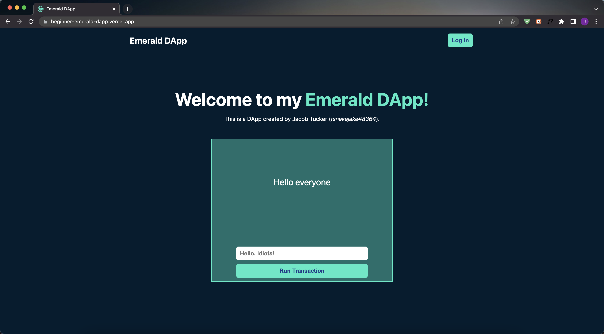

# 👋 WELCOME EVERYBODY!

> *Want to watch a Welcome Video instead of reading this text? You can watch <a href="" target="_blank">here</a>.*

## 📖 What is this course?

This is a course created by <a href="https://academy.ecdao.org" target="_blank">Emerald Academy</a>. It is meant to teach you how to make a DApp on the Flow blockchain. During the bootcamp, you will learn the major aspects of DApp development, including:
- Next.js (a front-end framework)
- Cadence (smart contract development)
- FCL (Flow Client Library)
- CSS (for styling)

During the course, we will be creating a DApp together. However, after completing the course, you will have the knowledge to develop your own DApps too.

## 🍀 Cadence

Cadence is the smart contract language that allows you to do things on the Flow blockchain. 

> For this course, you do not have to know the language, but if you want to learn A LOT about it, check out our <a href="https://github.com/emerald-dao/beginner-cadence-course/">Beginner Cadence Course</a>. It's really good.

## 🚀 What will I know by the end?

- An intro to the Flow blockchain (Chapter 1)
- Do some front-end development (Chapter 2)
- How to do basic styling (Chapter 2)
- How to make your own DApp (Chapters 2-5)
- How to do some Cadence coding (Chapter 3)
- Connect your DApp to the blockchain (Chapter 3-5)

## 🔖 What will I create?

This is what you will be creating, from start to finish: https://beginner-emerald-dapp.vercel.app/

## 😇 Who is this course NOT meant for?

- People who have never programmed before (meaning they don't know what a variable or function is).
- People who have already created very basic DApps using FCL. This will be too boring for you.

## 📚 How does it work?

The lessons will be split into "chapters," and chapters will be split into "days." I did it this way so you can manage your time and progress through the course as you like. Do not feel pressured to do this every day. Do it at your own pace and have fun with it! It will always be here :)

Here's an overview:
- Lessons split into days
- Written & video content associated with each day. The videos will be from my [YouTube Channel](https://www.youtube.com/channel/UCf6DzMRwj7SJ3nPrZqd5hHw).
- Quests to complete
- A completion certificate (<a href="">this FLOAT</a>) if you have completed all the quests. This will be proof that you have significant Cadence knowledge, and you will be able to show it to whoever you like as proof of expertise. Or just for fun! :D

## ❓ What do I need ahead of time?

- A huge smile and a motivation to learn.
- And some basic computer science knowledge (like what a variable and function are)

## 📁 What are quests?

Quests are like homework assignments. There are quests for every day of content. They will test your understanding of the concepts that are in that day's content. 

## 🙋 How to Submit Quests

When you finish a quest, please store all your quests together. Then, when you want them to be reviewed, submit them in the #quest-submissions channel inside the [Emerald Academy Discord](https://discord.gg/wjA875sMjV) and our instructors will review them.

## 🚗 When can I start?

Whenever you want my friend! :)

You can start the first day [here](https://github.com/emerald-dao/beginner-dapp-course/tree/main/chapter1.0/day1).

## 💚 Emerald Academy

This course is being used inside of <a href="https://academy.ecdao.org" target="_blank">Emerald Academy</a>, which is a series of educational resources & bootcamps created by your *best* friends at Emerald City. If you're interested in more educational content or getting involved in the broader Emerald City community, come join our <a href="https://discord.gg/emeraldcity" target="_blank">Discord</a> :)

## 🏁 Ending Remarks

If you have any feedback, please let me know. You can message me on Twitter, on Discord, on YouTube, anything. I am not smarter than any of you. If you have suggestions, I am sure they are great and I'd love to hear them.

Feel free to reach out to me on any of these platforms:

[Twitter](https://twitter.com/jacobmtucker)

[YouTube](https://www.youtube.com/channel/UCf6DzMRwj7SJ3nPrZqd5hHw)

Discord: tsnakejake#8364
