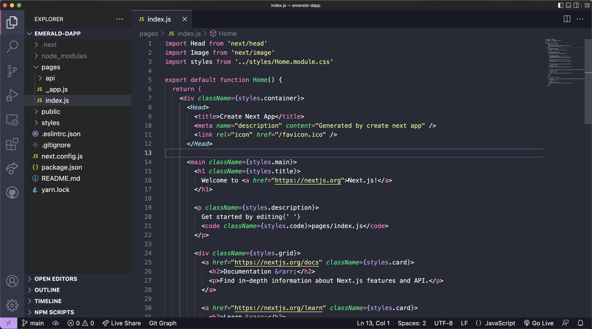
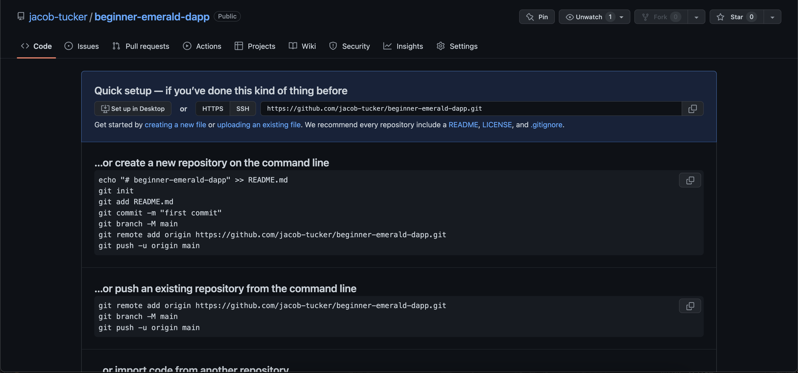
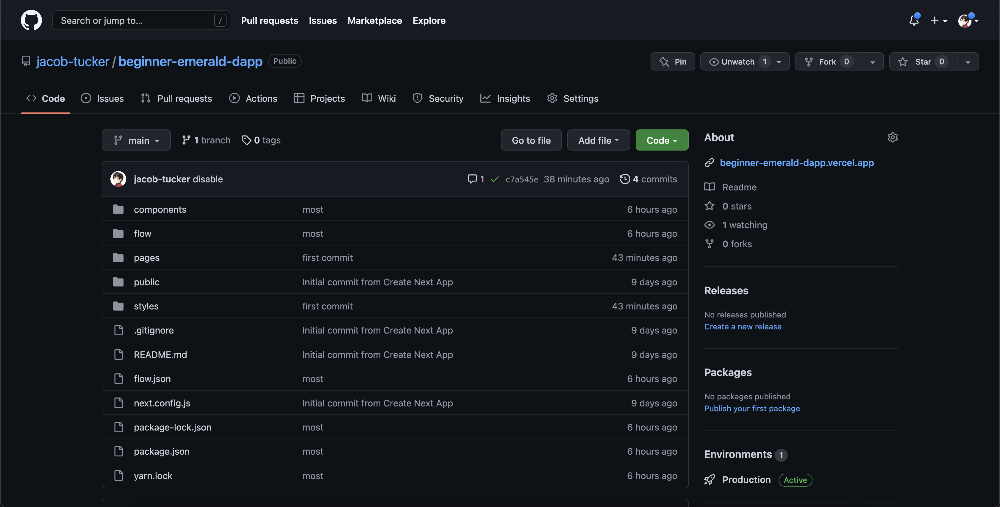

# Chapter 2 Day 1 - Creating our DApp

Hello you absolute idiots. In this day, we are going to actually jump into some code and start our DApp development. We will be using Next.js to create our first DApp.

# IMPORTANT NOTE

Chapter 2 will focus on frontend development, specifically the semantics of HTML, CSS, React.js/Next.js. If you are already comfortable with these languages, you still need to complete Chapter 2 because you will be setting up for other chapters. However it will be very quick for you, and you can skim through the lesson. That is totally okay. 

## What is Next.js?

> You can skip this section if you already know Next.js and frontend development

In this section, I will teach you what Next.js is. But first, let's learn the difference between "frontend" and "backend" development.

### Frontend

You know how when you load up a website, you see stuff on the screen? Well, there's two things that are immediately obvious to the user:

- *What* is being displayed.
- How it *looks*, or its *styling*. 
- What *happens* when you click something.

These things are usually what we call "frontend" development. It's what the user is experiencing. For example, on Instagram, when you are:
- Scrolling through your feed
- Looking at people's posts
- Clicking "search" and type stuff in
- Click the heart button and it turns red

... all of that is frontend stuff.

### Backend

However, there is also something called "backend" development. Backend STINKS. Just kidding, I just don't like it because it's hard. Backend development is the stuff that does more complicated procedures behind the scenes. In a traditional Web2 world (like Instagram), backend development usually includes:
- Fetching complicated information
- Storing things in a database
- Doing complex procedures that you wouldn't want to do on a frontend (to prevent loading times from being so long)

For example, on Instagram, when you click on a user's profile, the backend will load all of the users data (like their posts) and send it to the frontend so that the frontend can display it. 

Similarly, when you make a post, the backend will actually send the information about the post (like the description & image) to the backend so that the backend can send it off to some database somewhere.

### Back to Next.js

The reason I told you these things is because Next.js actually allows us to do both frontend and backend development. Yes, it is amazing. We will be using Next.js throughout this course for our DApp.

To learn more about Next.js, you can check out their <a href="https://nextjs.org/" target="_blank">website</a>.

## Creating Our DApp

To get a Next.js project onto our computer, we will be following their <a href="https://nextjs.org/docs/getting-started" target="_blank">docs</a>.

Open up a terminal on your computer and run:
> npx create-next-app@latest emerald-dapp

This will "clone" (or create) a Next.js project onto your computer and call it "emerald-dapp". What your computer is doing is installing all the necessary pieces of code and dependencies needed to run your application. Woohoo! This will be our DApp for the rest of the course.

## Launching Our DApp

After your computer does all of its complicated stuff and it looks like it is finished installing, go into your project directory by typing:
> cd emerald-dapp

Before we even jump into code, we can look at the project by typing:
> npm run dev 

This will start your application. Launch your browser of choice and go to http://localhost:3000/, you will see your website! Hopefully, it will look something like this:


*If it doesn't look like this, let an instructor know in the Emerald City Discord.*

## Installing VSCode

> If you have already installed VSCode, skip this step.

I know, this part is SO boring. But before we begin editing our project, we need to make sure you have <a href="https://code.visualstudio.com/" target="_blank">Visual Studio Code</a> (VSCode) installed on your computer. VSCode is a code editor.

## What is displayed on the screen?

Once you have it installed, make sure you are in your `emerald-dapp` directory and type:
> code .

This will open up your project in VSCode. Navigate to the `./pages/index.js` file and make sure it looks like this:


This is the frontend of your application. The code you are seeing is the "what". It is the stuff appearing on the screen when we went to http://localhost:3000/. All the text, boxes, links, etc.

## Styling

The webpage also looks pretty cool, right?! You may be wondering, how does it look like that? The answer is the *styling* of the application.

All of the styling is contained in the `./styles` folder. There are two ways to add styling: 
1. `./styles/globals.css` is a CSS file that applies to EVERYTHING. If you write a style in there, it will effect everything.
2. A "module", like `./styles/Home.module.css`, which is applied using the `styles` keyword in your Components. Modules only apply to the files they are imported in. We will learn more on this soon.

## Storing our DApp in Github

Before we wrap up for today, let's talk about GitHub. 

If you haven't used GitHub before, it's one of the most essential tools for developers. It lets you store all of your code in a place so you can easily track progress. Most often its used for personal projects or team projects so you can all collaborate on the same code base together. For example, here is Emerald City's Github: https://github.com/emerald-dao

> You can sign up for an account here: https://github.com/

Let's add our code to our own GitHub accounts. Another way of saying this is we are going to "push" our code to GitHub.

### Create a New Repository

A repository is basically like a project. 

1. Go to https://github.com/new and name your project "beginner-emerald-dapp"
2. Make it "public"
3. Click "Create repository"

You will now be taken to a page with no files inside of it. It should look like this:



### Pushing to Our Repository

Let's now add (or "push") our code to GitHub. Open up a terminal on your computer and make sure you're in the base directory of your project.

> Run the following lines of code:

```bash
git init
git add .
git commit -m "jacob is the best developer on the planet"
git branch -M main
git remote add origin
git push -u origin main
```

> Then, copy and paste the URL of the GitHub repository and insert it into the command below, and then run it:

```bash
git remote add origin [THE URL GOES HERE]
git push -u origin main
```

If this is your first time pushing to GitHub, it may ask you to log in. Then, if you go back to your GitHub repository, it should all be there!



### Making Changes

Now, what if we make changes to our code? How to we put it on GitHub?

When you make a change in your code and save the file, you can push it to GitHub by running:

```bash
git add .
git commit -m "you can put any message about the code changes here"
git push origin main
```

## Conclusion

All we wanted you to do today was install a Next.js project and run the project. If you could successfully do that, wooooohoooo! You will have no problem with the Quest.

In tomorrow's content, we will explain what all the code is actually doing, and make some changes.

# Quests

For your quest today, you have one task:

1. What is the difference between frontend and backend? Can you provide a real life example? Note: You can't use the one in this chapter.

2. What is the difference between global styling and module styling?

3. Take a screenshot of the running application and upload it to your quest submissions.

4. Upload the link to your public GitHub repository.
