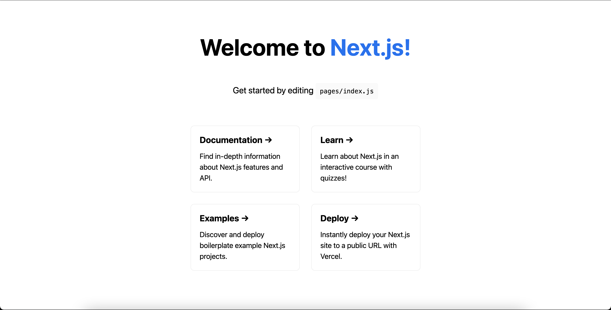
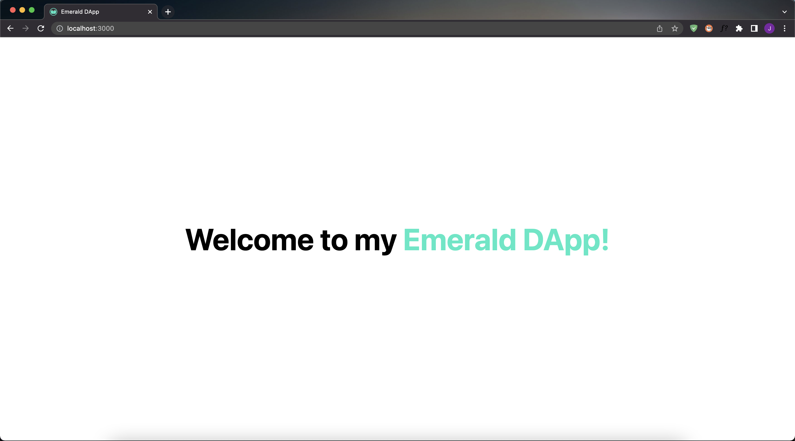
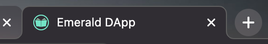
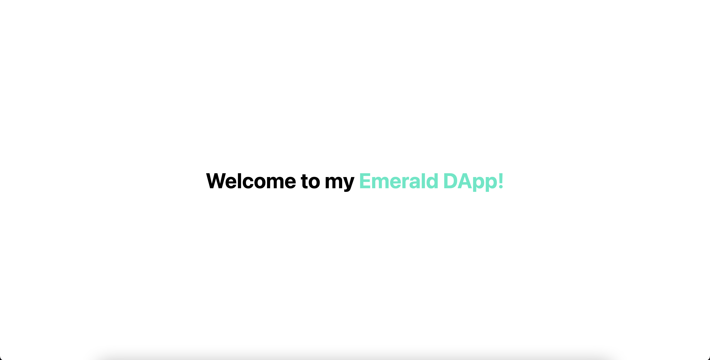
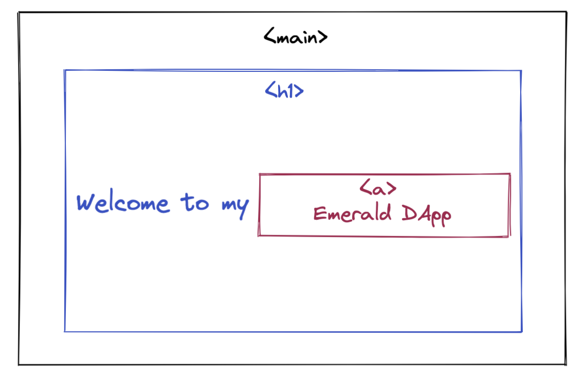
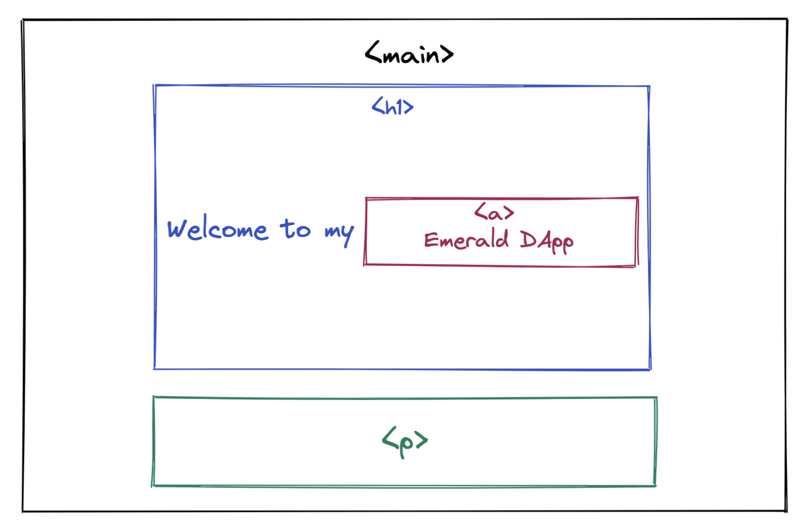

# Chapter 2 Day 2 - Learning Frontend Code

> If you have already worked with frontend code before, you may find this a bit boring. But it'll be really quick for you.

Hiiiiii! In this chapter, we will be giving you an introduction to HTML & CSS code. This will help you understand all of the code behind your running application.

## What are HTML & CSS?

HTML & CSS are languages used for frontend code.

**HTML is *what* is being displayed on your screen**. From our example yesterday...



The "Welcome to Next.js!", the "Get started...", and the 4 boxes with all of their text, that is the *what* is being displayed. That is thanks to HTML. 

On the other hand, **CSS is the *styling* of the application**. Using the same example, it is what makes the "Welcome to Next.js!" bigger than the rest, "Next.js" blue, the boxes appear in a grid format, etc. 

Now, we will change up the application to make it simpler, and then explain what all of it is actually doing.

## Remove Boilerplate Code

Let's remove some boilerplate code (code that is there at the start that just takes up space). We will explain what everything is afterwards. 

> Open up your `./pages/index.js` file and replace everything in the file with this code:

```javascript
import Head from 'next/head'
import styles from '../styles/Home.module.css'

export default function Home() {
  return (
    <div className={styles.container}>
      <Head>
        <title>Emerald DApp</title>
        <meta name="description" content="Created by Emerald Academy" />
        <link rel="icon" href="https://i.imgur.com/hvNtbgD.png" />
      </Head>

      <main className={styles.main}>
        <h1 className={styles.title}>
          Welcome to my <a href="https://academy.ecdao.org" target="_blank">Emerald DApp!</a>
        </h1>
      </main>
    </div>
  )
}
```

> Then, open up your `./styles/Home.module.css` file and replace everything with this code:

```css
.main {
  height: 100vh;
  display: flex;
  justify-content: center;
  align-items: center;
}

.title {
  font-size: 50px;
}

.title a {
  color: #35e8c5;
  text-decoration: none;
}
```

> Navigate back to http://localhost:3000/ and look at the changes. God Jacob, you are so talented. Our DApp looks SICK! I know, I know. I'm the best.

It should look something like this:



## Understanding What We Just Did

> If you already understand all of that, skip this section.

Let's understand what the heck we just did. First, let's start in the `./pages/index.js` file...

```javascript
import Head from 'next/head'
import styles from '../styles/Home.module.css'
```

- Importing something called `Head` and `styles`. 
- "Importing" just means we are bringing in some code to this file so we can use it somewhere.
- `from` means where that code is coming from. In this case, `next/head` is a built in location we can use, so don't worry about it. On the other hand, you can actually find the place `styles` is coming from: `./styles/Home.module.css`. We wrote that ourselves!
- We will see why we need these things soon.

---

```javascript
export default function Home() {

}
```

- This creates something called a `Component` that is named "Home".
- A component is a chunk of code that will get "rendered" (or put on the screen) if we return something from it
- All of the following code is stuff that lives inside of the Home component

---

```javascript
return (
  <div>
  </div>
)
```

- Returns something from the component with the `return` keyword.
- The `return` keyword takes all of the code inside of it and renders it on the screen.
- In this case, we're returning a `<div>` block, which is basically just a container for other code.
- When you return something from a component, you can only return 1 HTML tag. An HMTL tag is things like `<div>`, `<p>`, `<h1>`. They signal that they hold something inside of them, but are for different things. For example, `<h1>` is for a title, whereas `<p>` is for text, and `` is for an image. If you want to see a list of tags, see <a href="https://developer.mozilla.org/en-US/docs/Web/HTML/Element" target="_blank">here</a>.

---

```javascript
<Head>
  <title>Emerald DApp</title>
  <meta name="description" content="Created by Emerald Academy" />
  <link rel="icon" href="https://i.imgur.com/hvNtbgD.png" />
</Head>
```

- Notice why we imported `Head`. We use it here (`Head` is a built-in thing provided by Next.js).
- This changes the information in the browser tab. It looks like this:



---

```javascript
<main className={styles.main}>
  <h1 className={styles.title}>
    Welcome to my <a href="https://academy.ecdao.org" target="_blank">Emerald DApp!</a>
  </h1>
</main>
```

- Created another container of code using the `<main>` tag. 
- The `<main>` tag has something called a `className` (we will go over this later).
- Inside the `<main>` tag is an `<h1>` tag that has some text in it. 
- Inside the `<h1>` tag is an `<a>` tag that links to the Emerald Academy site.
- This piece of code is what you're seeing on the main page:



If it helps, you can think about this using the "box model":



Notice also that when you hover over "Emerald DApp", your cursor turns into a pointer. If you click it, it actually takes you to the Emerald Academy site. This is because it's an `<a>` tag in code, which is used for links!

---

Now that we have gone through all of our code, you should at least understand why the things on the screen are appearing there. 

## Understanding the Styling

Now let's walk through the styling, or in other words, the CSS code. CSS is what gives our application code some spice and makes it look the way it does.

Go to `./styles/Home.module.css` and let's break up the code just like we did before:

```css
.main {
  height: 100vh;
  display: flex;
  justify-content: center;
  align-items: center;
}
```

- This means that whatever has a `className` of "main" should have the styling inside the `{}`
- `height: 100vh` means that this "box" takes up the whole height of the screen. `vh` is a measurement of the screen's dimensions, so `100vh` means the whole screen.
- `display: flex`, `justify-content: center`, and `align-items: center` put the text in the middle of the screen.

---

```css
.title {
  font-size: 50px;
}
```

- This means that whatever has a `className` of "title" should have a `font-size` of `50px`.

---

```css
.title a {
  color: #35e8c5;
  text-decoration: none;
}
```

- This means that any `<a>` tag inside of a tag with a `className` of "title" should be a certain color. 
- `text-decoration: none` just means it has no underline when we click the link.

---

PHEW! We are done. Wow, that was a lot. And maybe boring? I don't know. I hope you're still alive.

## Learn More

Because this is not necessarily a course on frontend development, if you'd like to learn more about HTML and CSS code, please check out these resources:

- https://www.codecademy.com/catalog/language/html-css

> If you have any other resources that have helped you, and you want us to list them, please let me know!

# Quests

1. Change the color of "Emerald DApp" to whatever color you want
2. Change the font size of the title
3. Change the "Emerald DApp" link to a different link (this means messing with the `<a>` tag)
4. There are two parts.

4a. Inside of your `<main>` tag, add a `<p>` tag and put whatever text you want in it. 

4b. Go to the `.main` class and add this line: `flex-direction: column`. Watch what it does!

The box model for Quest #4 looks like this:



--- 

Take a screenshot of your changes (both the code and the result) and upload it to your quests

