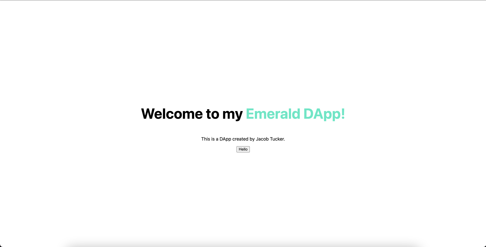
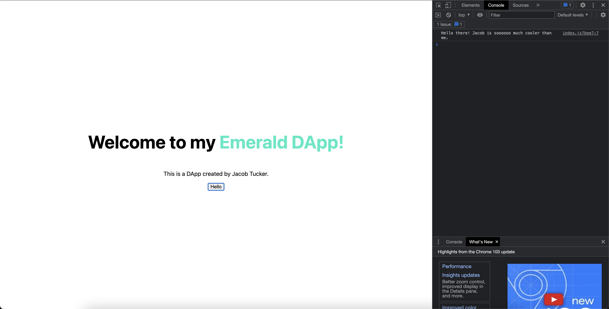
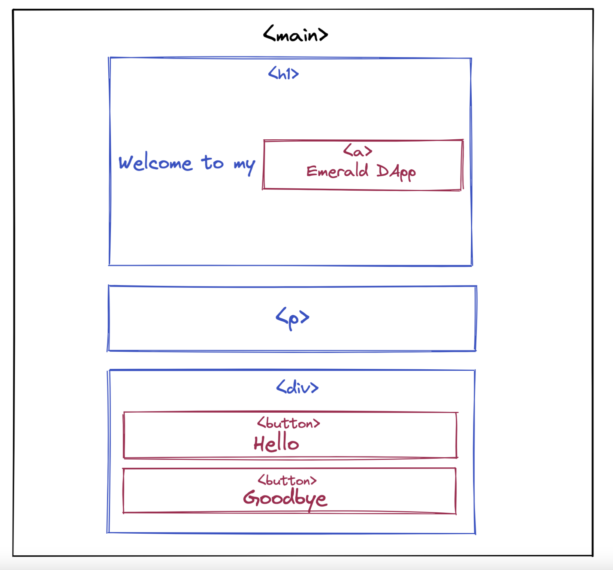

# Chapter 2 Day 3 - Adding Javascript Code

> If you have already worked with React.js or Javascript code before, you may find this a bit boring. But it'll be really quick for you.

Sup sup! In this chapter, we will be teaching you what Javascript code is and what it does. Then we will add some to our project.

> Also, before moving on, make sure to complete all previous quests. They are necessary to continuing at this point.

## What is Javascript?

When we talked about HTML & CSS, we concluded that HTML is the *what*, and CSS is the *styling*. Well, adding Javascript will allow us to *do things* on the site.

For example, when you go to an NFT marketplace and click a "buy" button, and it does something. Or when you load up Instagram and the application somehow fetches all your posts and likes from some database, that is Javascript.

Woohoo, we love you Jacob! This sounds like so much fun. I know, it is. Let's dive into it.

## Adding Some Javascript

Let's add some Javascript to our application, and maybe it will make more sense.

> Open up your `./pages/index.js` file. Under the `<p>` tag you added in the Quests of day 2, add this line of code: `<button>Hello</button>`

The surrounding code should now look something like this:

```javascript
<main className={styles.main}>
  <h1 className={styles.title}>
    Welcome to my <a href="https://academy.ecdao.org" target="_blank">Emerald DApp!</a>
  </h1>
  <p>This is a DApp created by Jacob Tucker.</p>

  <button>Hello</button>
</main>
```

---

> Go back to your browser at http://localhost:3000 and see that there is now a button under to the text in the middle of the page. It should look like:



---

Cool! Now let's make that button do something. 

> Go back to your code and right before your `return` keyword, add this piece of code:

```javascript
function printHello() {
  console.log("Hello there! Jacob is soooooo much cooler than me.")
}
```

> Then, change your `<button>` to be this: 

```html
<button onClick={printHello}>Hello</button>
```

What we just did is add a function called `printHello` that will perform some task when it is called. In this case, the "something" is a `console.log` that prints something to the console. 

Then, we added an `onClick` "handler" to our button that will call the `printHello` function when we click the button on the screen.

Your entire file should now look like this: 

```javascript
import Head from 'next/head'
import styles from '../styles/Home.module.css'

export default function Home() {

  function printHello() {
    console.log("Hello there! Jacob is soooooo much cooler than me.")
  }

  return (
    <div>
      <Head>
        <title>Emerald DApp</title>
        <meta name="description" content="Created by Emerald Academy" />
        <link rel="icon" href="https://i.imgur.com/hvNtbgD.png" />
      </Head>

      <main className={styles.main}>
        <h1 className={styles.title}>
          Welcome to my <a href="https://academy.ecdao.org" target="_blank">Emerald DApp!</a>
        </h1>
        <p>This is a DApp created by Jacob Tucker.</p>

        <button onClick={printHello}>Hello</button>
      </main>
    </div>
  )
}
```

---

## Developer Console

The Developer Console is something we can use to actually see our `console.log`s from our code. In order to open the Developer Console:

1. Go back to your browser
2. Right click the screen
3. Click "inspect"
4. Go to the "Console" tab
5. Click the "Hello" button on the main screen

You will see something like this:



When you click the button, you will see messages popping up in the "developer console" now. Usually, developers use the developer console to print error messages or debug their code when they don't know what is wrong. Or in this case, we used it just to make sure things were working. 

## Conclusion

That's all for today!

Tomorrow, we will finish the base skeleton of our DApp.

## Quests

Today, we will split the Quests into two different parts.

1. In this part, we will be adding another button and changing up some styling.
- Wrap the `<button>` tag we added inside of a `<div>`. Add a `className` called `styles.flex` to that `<div>`. Make sure the `<button>` is inside of it.
- Then, add another `<button>` inside the `<div>` tag and put "Goodbye" inside of it.
- In `./styles/Home.module.css`, add a new style for the "flex" class, and inside of it, add one line: `display: flex`.
- Your page should now look like this:


Here is the box model for what your code should look like:



2. Now we're going to add an action to your new button.
- To your second button, add an `onClick` handler and call a function named `printGoodbye`.
- Define a new function called `printGoodbye` under the `printHello` function
- Make it `console.log` "Goodbye"


To submit your quests, take a picture of both the screen and the console logs in the developer console.


