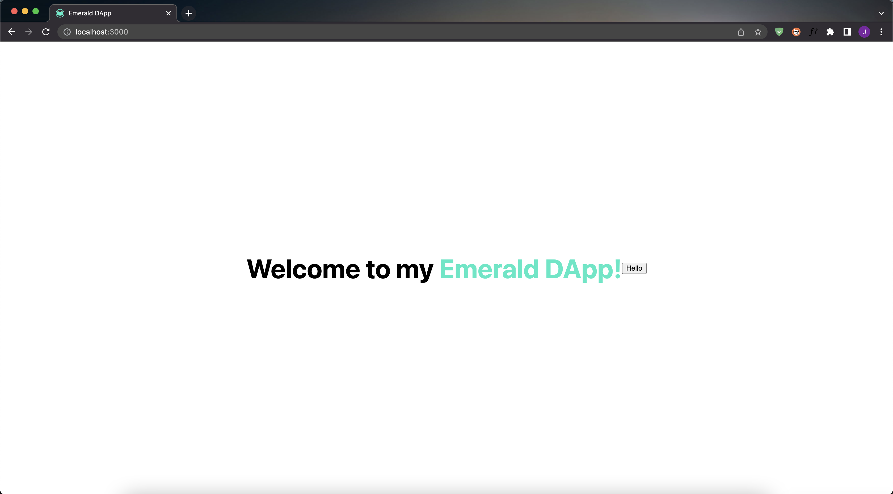

# Chapter 2 - Day 3 - Adding Javascript Code

> If you have already worked with React.js or Javascript code before, you may find this a bit boring. But it'll be really quick for you.

Sup sup! In this chapter, we will be teaching you what Javascript code is, and we will add some to our project.

## What is Javascript?

When we talked about HTML & CSS, we concluded that HTML is the *what*, and CSS is the *styling*. Well, adding Javascript will allow us to *do things* on the site.

For example, when you go to an NFT marketplace and click a "buy" button, and it does something. Or when you load up Instagram and the application somehow fetches all your posts and likes from some database, that is Javascript.

Woohoo, we love you Jacob! This sounds like so much fun. I know, it is. Let's dive into it.

## Adding Some Javascript

Let's add some Javascript to our application, and maybe it will make more sense.

Open up your `./pages/index.js` file. Under the `<h1>` tag, add this line of code: `<button>Hello</button>`

The surrounding code should now look something like this:

```javascript
<main className={styles.main}>
  <h1 className={styles.title}>
    Welcome to my <a href="https://academy.ecdao.org" target="_blank">Emerald DApp!</a>
  </h1>

  <button>Hello</button>
</main>
```

---

Go back to your browser at http://localhost:3000 and see that there is now a button next to the main title in the middle of the page. It should look like:



---

Cool! Now let's make that button do something. Go back to your code and right before your `return` keyword, add this piece of code:

```javascript
function printHello() {
  console.log("Hello there! Jacob is soooooo much cooler than me.")
}
```

Then, change your `<button>` to be this: `<button onClick={printHello}>Hello</button>`.

What we just did is add a function called `printHello` that will perform some task when it is called. In this case, the "something" is a `console.log` that prints something to the console. 

Then, we added an `onClick` "handler" to our button that will call the `printHello` function when we click the button on the screen.

Your entire file should now look like this: 

```javascript
import Head from 'next/head'
import styles from '../styles/Home.module.css'

export default function Home() {

  function printHello() {
    console.log("Hello there! Jacob is soooooo much cooler than me.")
  }

  return (
    <div>
      <Head>
        <title>Emerald DApp</title>
        <meta name="description" content="Created by Emerald Academy" />
        <link rel="icon" href="https://i.imgur.com/hvNtbgD.png" />
      </Head>

      <main className={styles.main}>
        <h1 className={styles.title}>
          Welcome to my <a href="https://academy.ecdao.org" target="_blank">Emerald DApp!</a>
        </h1>

        <button onClick={printHello}>Hello</button>
      </main>
    </div>
  )
}
```

---

Now,
1. Go back to your browser
2. Right click the screen
3. Click "inspect"
4. Go to the "Console" tab
5. Click the "Hello" button on the main screen

You will see a bunch of messages popping up in the "developer console" now. Usually, developers use the developer console to print error messages or debug their code when they don't know what is wrong.
