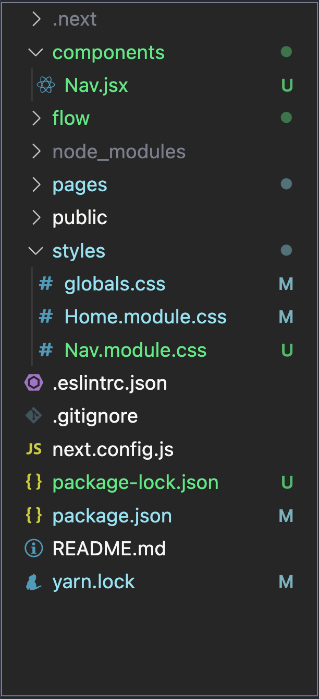
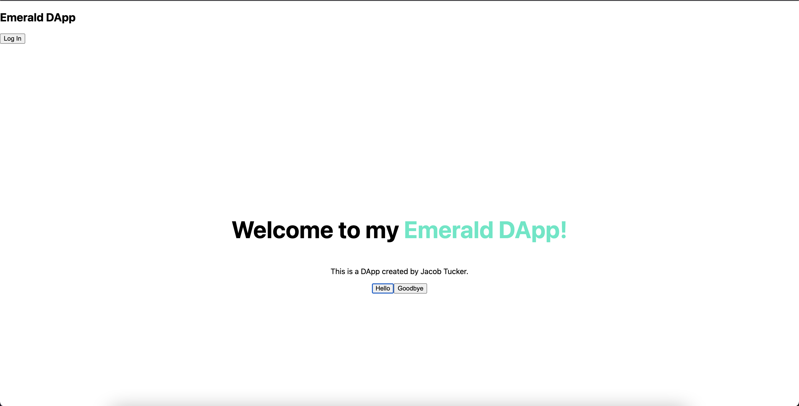
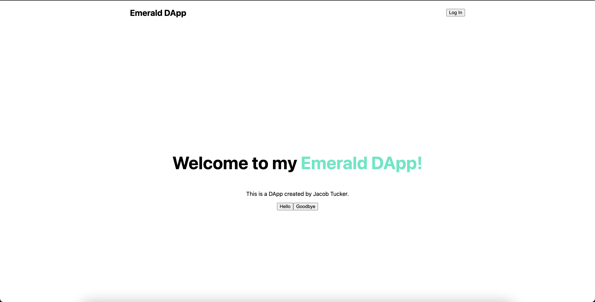

# Chapter 2 Day 4 - Finishing the Skeleton

Hey there! In this day, we will finalize the base skeleton of our DApp so that, in Chapter 3, we can focus purely on the blockchain stuff.

## Adding a Navigation Bar

What is a website without a nav bar? Let's add one together.

### Creating a New Component

One solution to creating a new nav bar would be to just throw some more code into our `./pages/index.js` file. But we don't want to put a ton of somewhat unrelated code into the same file, because if we did, complicated DApps would have all your code in one file and it would get extremely messy. The way that good coders (like me, of course!) structure our code is so that related things are together and separate from everything else. So let's create a new component!

> In the base directory (where your `styles` and `pages` folder live), make a new folder called `components`. In that folder, create a file called `Nav.jsx`. It should look like this:

> After that, inside your `styles` folder, make a new file called `Nav.module.css`. This will be all the styling for our `Nav` component.

Your directory should be structured like this:



### Adding Some Code

> Inside of your `Nav.jsx` file, add this code:

```javascript
import styles from '../styles/Nav.module.css';

export default function Nav() {
  return (
    <nav>
    </nav>
  )
}
```

This code is very simple, it:
- Imports the stylesheet we created previously
- Creates a new component called `Nav`
- Returns an empty `<nav>` tag

> Next, inside the `<nav>` tag, let's add some code:

```javascript
<nav>
  <h1>Emerald DApp</h1>
  <button>Log In</button>
</nav>
```

This is great! But the problem is, nothing is displaying on the screen. Why is that? Well, it's because we don't put our `Nav` component anywhere in our DApp, so of course it's not displaying!

> Go back to `./pages/index.js` add two things:
1. `import Nav from "../components/Nav.jsx"` at the top
2. Right before the `<main>` component, add `<Nav />`

Your `./pages/index.js` file should now look like this:

```javascript
import Head from 'next/head'
import styles from '../styles/Home.module.css'
import Nav from '../components/Nav.jsx';

export default function Home() {

  function printHello() {
    fcl.authenticate();
  }

  function printGoodbye() {
    console.log("Goodbye.")
  }

  return (
    <div>
      <Head>
        <title>Emerald DApp</title>
        <meta name="description" content="Created by Emerald Academy" />
        <link rel="icon" href="https://i.imgur.com/hvNtbgD.png" />
      </Head>

      <Nav />

      <main className={styles.main}>
        <h1 className={styles.title}>
          Welcome to my <a href="https://academy.ecdao.org" target="_blank">Emerald DApp!</a>
        </h1>
        <p>This is a DApp created by Jacob Tucker.</p>

        <div className={styles.flex}>
          <button onClick={printHello}>Hello</button>
          <button onClick={printGoodbye}>Goodbye</button>
        </div>
      </main>
    </div>
  )
}
```

You should now notice that your project looks like this:



### Making it Less Ugly

Inside of `./styles/Nav.module.css`, let's make a new class called `nav`:

```css
.nav {
  display: flex;
  justify-content: space-around;
  align-items: center;
}
```

> Now, inside of our `Nav.jsx` file, add the `nav` className to the `<nav>` tag:

```javascript
<nav className={styles.nav}>
  <h1>Emerald DApp</h1>
  <button>Log In</button>
</nav>
```

You should now see that our `<Nav>` component looks pretty cool!



## Adding an Input Field

The DApp we are building is one where you can change a "Greeting" value inside our contract, and then display it to the public. In order to do that, we need to be able to type our new greeting into an input box and then send it to the blockchain. So, let's make an input field!

Inside of `./pages/index.js`, do two things: 

> First, replace the "Goodbye" `<button>` with this code: 

```html
<input placeholder="Hello, Idiots!" />
```

Your webpage should now look like this:


We basically created an input field and added a placeholder of "Hello, Idiots!". Now, let's store the value we type into the input field somewhere.

> At the top of the file, add this line: 
```javascript
import { useState } from 'react';
```

> Then, right after the line that says `export default function Home() {`, add this line of code: 
```javascript
const [newGreeting, setNewGreeting] = useState('');
```

`useState` is a fancy way to store variables. What it will do is create a variable called `newGreeting`. We can change this variable by calling `setNewGreeting` any time. Let's make it so that, when we type in the `<input>` tag, it changes `newGreeting`!

> Make your `<input>` tag look like this: 
```html
<input onChange={(e) => setNewGreeting(e.target.value)} placeholder="Hello, Idiots!" />
``` 

Because of the `onChange` handler, it will call the function inside of the `{}` brackets every time the input is changed. That function takes in an `e`, which represents an "event" of the input field changing, and calls `setNewGreeting` (which changes the `newGreeting` variable) to `e.target.value`, which is the value that we type into the box.

You will test out if this works inside your Quests.

## Conclusion

That is all we have for Chapter 2. In this Chapter, we learned about HTML, CSS, and Javascript. These are the foundational elements we'll need to actually start learning about integrating Blockchain code into our DApps. 

If you struggled with Chapter 2, I would recommend checking out introductory React.js or Next.js courses. They will help you understand all of this foundational stuff.

In Chapter 3, we will start exploring some blockchain code.

## Quests

1. Change the `printHello` function to be called `runTransaction`. 
2. Change the "Hello" text inside the button to "Run Transaction".
3. Inside the `runTransaction` function, add some code to console log your `newGreeting` variable to the developer console.
4. Go back to your webpage, type something into the input box, and press "Run Transaction". Open your developer console and you will see some thing being printed! 

To upload your quests, show us your `./pages/index.js` file and take a screenshot of your `newGreeting` being printed to the developer console.
