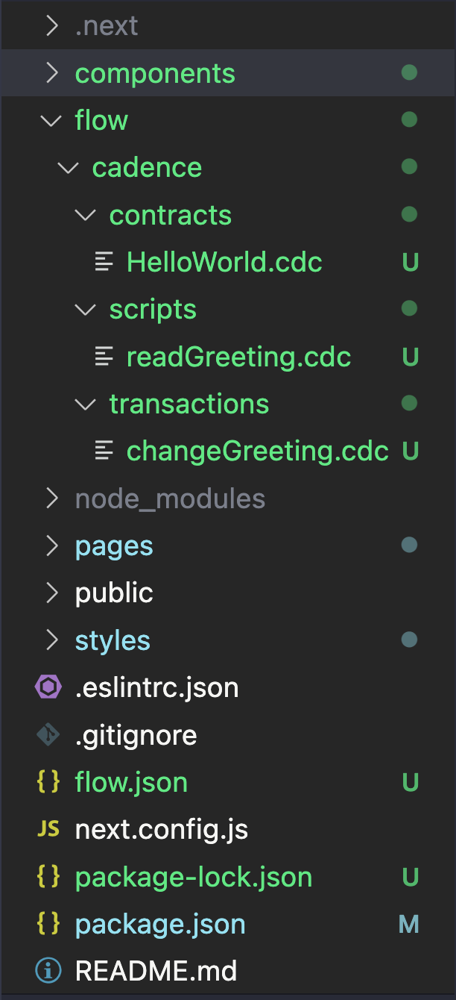
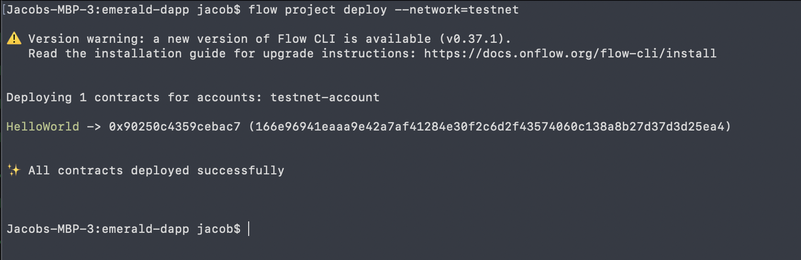
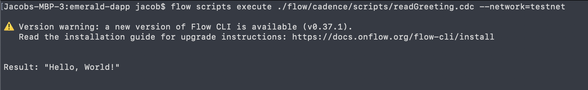
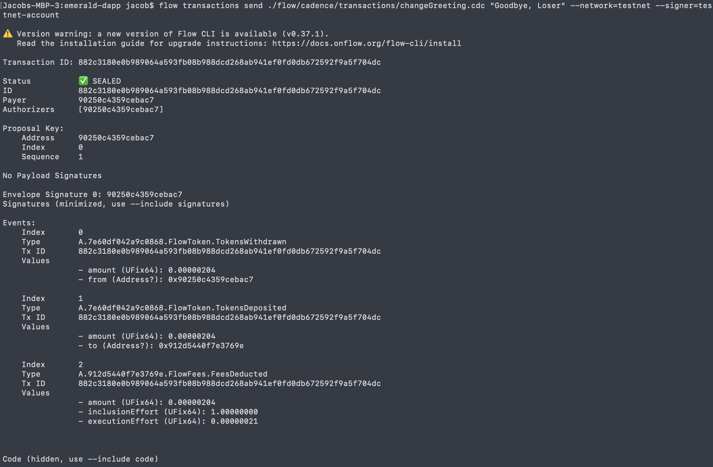
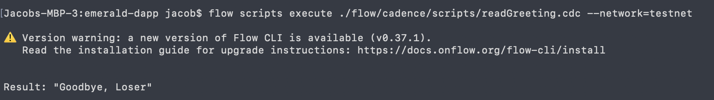

# Chapter 3 Day 3 - Bringing Cadence to our DApp & Deploying our Contract

Today's lesson will be very short (WOOOHOOOO! We don't have to read Jacob's annoying course for too long!). We are going to bring our Cadence code into our DApp.

## Installing the Cadence VSCode Extension

*Only Mac and Linux will work.*

Now that we're no longer on the playground, we want to be able to have errors show up in our VSCode when we're coding Cadence. There's an extension to do that!

> Open VSCode. On the left side of VSCode, there's an icon that looks like 4 squares. Click that and search "Cadence".

> Click on the following extension and press "Install":


## Installing the Flow CLI & flow.json

The Flow CLI will allow us to run transactions & scripts from the terminal, and allow us to do other Flow stuff like creating `flow.json` (coming soon...)

> Install the [Flow CLI](https://docs.onflow.org/flow-cli/install/). You can do that by:

**Mac**
- Pasting `sh -ci "$(curl -fsSL https://storage.googleapis.com/flow-cli/install.sh)"` into a terminal

**Windows**
- Pasting `iex "& { $(irm 'https://storage.googleapis.com/flow-cli/install.ps1') }"` into PowerShell

**Linux** 
- Pasting `sh -ci "$(curl -fsSL https://storage.googleapis.com/flow-cli/install.sh)"` into a terminal

You can confirm the Flow CLI is installed by going to a terminal and typing `flow version`. If a version appears, you're good to go.

## Flow Folder

Inside of our Emerald DApp, let's make a new folder called `flow`.

Inside of the `flow` folder, let's make another folder called `cadence`.

Inside of the `cadence` folder, let's make a `contracts` folder, a `transactions` folder, and a `scripts` folder.

Inside of the `contracts` folder, add a new file called `HelloWorld.cdc`. In that file, put our contract code from yesterday:

```cadence
pub contract HelloWorld {

    pub var greeting: String

    pub fun changeGreeting(newGreeting: String) {
        self.greeting = newGreeting
    }

    init() {
        self.greeting = "Hello, World!"
    }
}
```

---

Inside the transactions folder, make a new file called `changeGreeting.cdc` and put our transaction code from yesterday:

```cadence
import HelloWorld from 0x01 // THIS IS NO LONGER CORRECT

transaction(myNewGreeting: String) {

  prepare(signer: AuthAccount) {}

  execute {
    HelloWorld.changeGreeting(newGreeting: myNewGreeting)
  }
}
```

Notice that the import is now wrong. We aren't importing from `0x01` anymore, that was just a playground thing. In this case, we are importing from a local contract that exists in our project. So change it to:

```cadence
import HelloWorld from "../contracts/HelloWorld.cdc"
```

--- 

Inside the scripts folder, add a new file called `readGreeting.cdc` and put in our script code from yesterday:

```cadence
import HelloWorld from "../contracts/HelloWorld.cdc"

pub fun main(): String {
    return HelloWorld.greeting
}
```

Your project directory should now look like this:



---

### flow.json

> Now that we have our contract in our project directory, go to your terminal and `cd` into the base project directory. 

> Type `flow init`

This will create a `flow.json` file inside your project. This is needed to deploy contracts and to give us compile errors inside our Cadence code.

## Deploying our Greeting Contract to TestNet

Sweet! Now let's deploy our contract to TestNet so that we can start interacting with it.

## Configuring `flow.json`

> Inside of your `flow.json` file, make the "contracts" object look like this:

```json
"contracts": {
  "HelloWorld": "./flow/cadence/contracts/HelloWorld.cdc"
},
```

This will allow your `flow.json` to know where your contracts live.

## Creating an Account

> 🔐 Generate a **deployer address** by typing `flow keys generate --network=testnet` into a terminal. Make sure to save your public key and private key somewhere, you will need them soon.


> 👛 Create your **deployer account** by going to https://testnet-faucet.onflow.org/, pasting in your public key from above, and clicking `CREATE ACCOUNT`: 


> After it finishes, click `COPY ADDRESS` and make sure to save that address somewhere. You will need it!

> ⛽️ Add your new testnet account to your `flow.json` by modifying the following lines of code. Paste your address you copied above to where it says "YOUR GENERATED ADDRESS", and paste your private key where it says "YOUR PRIVATE KEY".

```json
"accounts": {
  "emulator-account": {
    "address": "f8d6e0586b0a20c7",
    "key": "5112883de06b9576af62b9aafa7ead685fb7fb46c495039b1a83649d61bff97c"
  },
  "testnet-account": {
    "address": "YOUR GENERATED ADDRESS",
    "key": {
      "type": "hex",
      "index": 0,
      "signatureAlgorithm": "ECDSA_P256",
      "hashAlgorithm": "SHA3_256",
      "privateKey": "YOUR PRIVATE KEY"
    }
  }
},
"deployments": {
  "testnet": {
    "testnet-account": [
      "HelloWorld"
    ]
  }
}
```

> 🚀 Deploy your HelloWorld smart contract:

```sh
flow project deploy --network=testnet
```



## Interacting with our Contract

Now that we deployed our contract to testnet, we can interact with it in our terminal using the Flow CLI.

### Reading our Greeting

To run our `readGreeting.cdc` script from the terminal, go to your project directory and type:

```bash
flow scripts execute ./flow/cadence/scripts/readGreeting.cdc --network=testnet
```

If it works properly, you will see this:



Boom! It returned "Hello, World!", which is exactly what our `greeting` variable is in the contract. YAAAAAAAY!!

### Changing our Greeting

To run our `changeGreeting.cdc` transaction from the terminal, go to your project directory and type:

```bash
flow transactions send ./flow/cadence/transactions/changeGreeting.cdc "Goodbye, Loser" --network=testnet --signer=testnet-account
```

If it works properly, you will see this:



That means the transaction is sealed (completed) and worked! If you run the script to read the greeting again, hopefully you will see:



NICEEEEEE!!! We successfully changed our `greeting` in our contract. This is so cool.

## Conclusion

That was a lot today, but how cool is this?! We deployed our own contract to Flow Testnet, ran a script to read our `greeting`, and then ran a transaction to change it. You are all doing amazing!

## Quests

1. Create a new smart contract in Cadence that has at least the following two things:
- A variable to hold a value (like a number or a piece of text)
- A function to change that variable

After, deploy that contract to the same testnet account you generated today.

2. Send a screenshot of you reading the variable from your new contract using the Flow CLI
3. Send a screenshot of you changing the variable from your new contract using the Flow CLI
4. Send a screenshot of you reading your changed variable from your new contract using the Flow CLI
5. Go to https://flow-view-source.com/testnet/. Where it says "Account", paste in the Flow address you generated and click "Go". On the left hand side, you should see your "HelloWorld" contract and your new contract. Isn't it so cool to see them live on Testnet? Then, send the URL to the page. 
- EXAMPLE: https://flow-view-source.com/testnet/account/0x90250c4359cebac7/