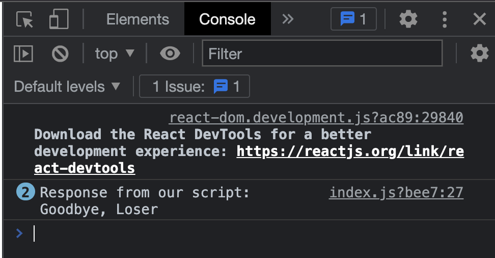

# Chapter 4 Day 2 - Running a Script

Yoooooooooo yo yo YO! Today we are going to learn how to run a script on the Blockchain to read our `greeting` variable from our smart contract.

## Videos

If you watch this video, it will help you understand the content for today. Note that they are different, but the concept is the same: https://www.youtube.com/watch?v=XjderBnmPtU

## Quick Overview of Scripts

If you remember back from Chapter 1, a script will allow us to *read* information from our smart contracts. In addition, scripts are completely free. 

We will utilize a script to read our `greeting` variable from our smart contract, which we deployed in Chapter 3 Day 3.

## Executing a Script using FCL

In our `./pages/index.js` file, let's add a function to execute a script on Flow using FCL.

> Under the `runTransaction` function you made in the quests of Chapter 2 Day 4, make a new function called `executeScript`:

```javascript
async function executeScript() {

}
```

What does `async` mean? `async` means this function is an "asynchronous function." The reason we must make it an asynchronous function is because we're going to be returning something called a `Promise` from our script call, and to wait for the result of that `Promise`, we need to use the `await` keyword. Let's keep going so you can see what I mean.

Inside your function, let's actually execute a script using FCL by doing two things:
1. Importing `fcl` at the top of the file so we can call the `fcl.query` function: 
```javascript
import * as fcl from "@onflow/fcl"
```
2. Adding this code inside the `executeScript` function:

```javascript
async function executeScript() {
  const response = await fcl.query({
    cadence: ``, // CADENCE CODE GOES IN THESE ``
    args: (arg, t) => [] // ARGUMENTS GO IN HERE
  })

  console.log("Response from our script: " + response);
}
```

Okay whoah. That's a lot. What just happened?
1. `const response = await fcl.query()` - this part is saying, "We are going to execute a script using the `fcl.query` function. Then, we are going to *wait* for that result using the `await` keyword (which is why we needed to make this function `async`), and then we are going to store the result inside the `response` variable.
2. Inside the `fcl.query` function, it takes in an object with a few things inside of it: `cadence` (which is the Cadence code as a string), and `args` (which is a list of arguments needed for our script).
3. We `console.log` the result afterwards.

In this case, we want to read the `greeting` variable from our contract. Well, we actually already wrote it in Chapter 3 Day 1!

> Go to your `./flow/cadence/scripts/readGreeting.cdc` function and copy everything in that file into your `cadence` string. It should look like this:

```javascript
async function executeScript() {
  const response = await fcl.query({
    cadence: `
    import HelloWorld from "../contracts/HelloWorld.cdc"

    pub fun main(): String {
        return HelloWorld.greeting
    }
    `, 
    args: (arg, t) => [] // ARGUMENTS GO IN HERE
  })

  console.log("Response from our script: " + response);
}
```

Sweet! But there's one problem: The blockchain is going to have no idea what `"../contracts/HelloWorld.cdc"` means. Instead, we have to give it an address! 

In Chapter 3 Day 3, you deployed your contract to a testnet account. 

> Get the address for that account (you probably stored it in your `flow.json`) and replace it in the import, like so:

```javascript
async function executeScript() {
  const response = await fcl.query({
    cadence: `
    import HelloWorld from 0x90250c4359cebac7 // THIS WAS MY ADDRESS, USE YOURS

    pub fun main(): String {
        return HelloWorld.greeting
    }
    `, 
    args: (arg, t) => [] // ARGUMENTS GO IN HERE
  })

  console.log("Response from our script: " + response);
}
```

Nice! Now let's figure out how to call that function in our code so we can see if it's working!

## Seeing our Greeting

We could make a button and call this function every time we click the button, but that's boring and we already know how to do that. Instead, lets call this function every time the page refreshes.

We learned in Chapter 4 Day 1 (yesterday) that we can do this by using `useEffect` to do something every time something happens (which in this case is a page refresh). Let's do that in code by doing two things:
1. Adding `useEffect` to our imports: 
```javascript
import { useState, useEffect } from 'react';
```
2. Putting a `useEffect` underneath our `executeScript` function:

```javascript
useEffect(() => {
  executeScript()
})
```

But how do we make sure this happens every time we refresh the page? Remember from Chapter 4 Day 1 that you have to add the `[]`:

```javascript
useEffect(() => {
  executeScript()
}, [])
```

Now, if you go back to http://localhost:3000 and open your developer console, you should see your greeting appearing!



Of course, mine is "Goodbye, Loser". How sweet of me.

## Conclusion

We did it! We are successfully reading from the blockchain. Here is what your `./pages/index.js` page should now look like:

```javascript
import Head from 'next/head'
import styles from '../styles/Home.module.css'
import Nav from '../components/Nav.jsx';
import { useState, useEffect } from 'react';
import * as fcl from "@onflow/fcl";

export default function Home() {
  const [newGreeting, setNewGreeting] = useState('');

  function runTransaction() {
    console.log("Running transaction!");
    console.log("Changing the greeting to: " + newGreeting);
  }

  async function executeScript() {
    const response = await fcl.query({
      cadence: `
      import HelloWorld from 0x90250c4359cebac7 // THIS WAS MY ADDRESS, USE YOURS
  
      pub fun main(): String {
          return HelloWorld.greeting
      }
      `,
      args: (arg, t) => [] // ARGUMENTS GO IN HERE
    })

    console.log("Response from our script: " + response);
  }

  useEffect(() => {
    executeScript()
  }, [])

  return (
    <div>
      <Head>
        <title>Emerald DApp</title>
        <meta name="description" content="Created by Emerald Academy" />
        <link rel="icon" href="https://i.imgur.com/hvNtbgD.png" />
      </Head>

      <Nav />

      <main className={styles.main}>
        <h1 className={styles.title}>
          Welcome to my <a href="https://academy.ecdao.org" target="_blank">Emerald DApp!</a>
        </h1>
        <p>This is a DApp created by Jacob Tucker.</p>

        <div className={styles.flex}>
          <button onClick={runTransaction}>Run Transaction</button>
          <input onChange={(e) => setNewGreeting(e.target.value)} placeholder="Hello, Idiots!" />
        </div>
      </main>
    </div>
  )
}
```

## Quests

You have a lot of tools under your belt now, in fact much more than you think you do. Let's see what you're capable of...

1. Instead of console logging the result after the script executes, I want you to:
- Make a new variable named `greeting` using `useState`
- Set the `greeting` variable to the `response` of the script call
- Create a `<p>` tag after the `<div className={styles.flex}>` tag
- Put the `greeting` variable inside of that `<p>` tag. This will make the result of your script show on your webpage! It should look something like this:


2a. I deployed a contract called `SimpleTest` to an account with an address of `0x6c0d53c676256e8c`. I want you to make a button that, when clicked, executes a script to read the `number` variable from that contract. If you're curious, you can see the contract here: https://flow-view-source.com/testnet/account/0x6c0d53c676256e8c/contract/SimpleTest

Submit all the code you used to call the script, and the result of the script.

2b. Then, I want you to remove the button, and make the script execute every time the page refreshes.

Submit all the code you used to do this.