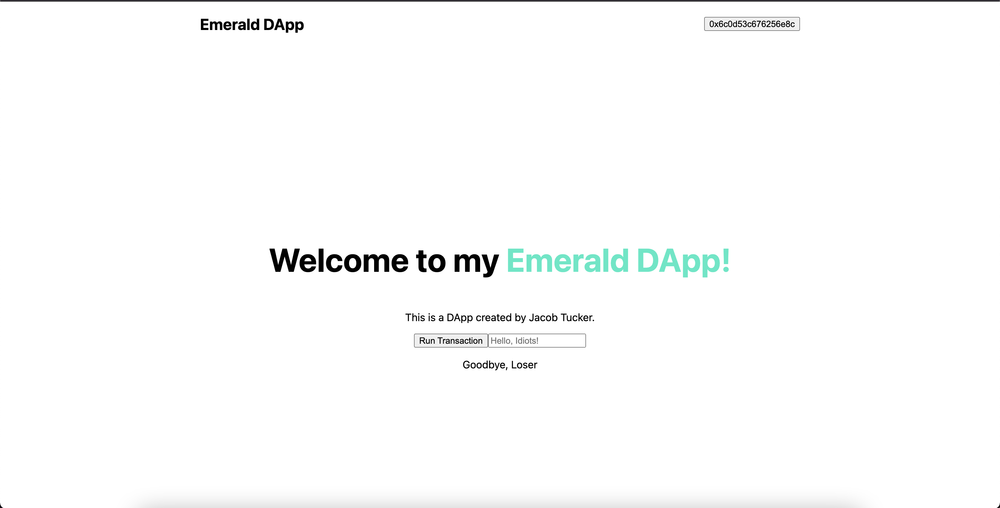
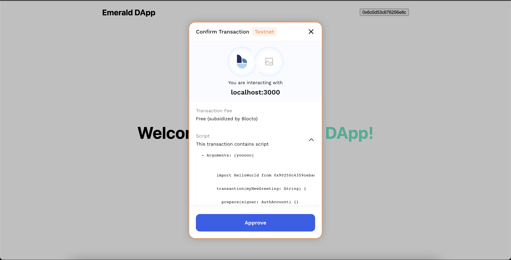
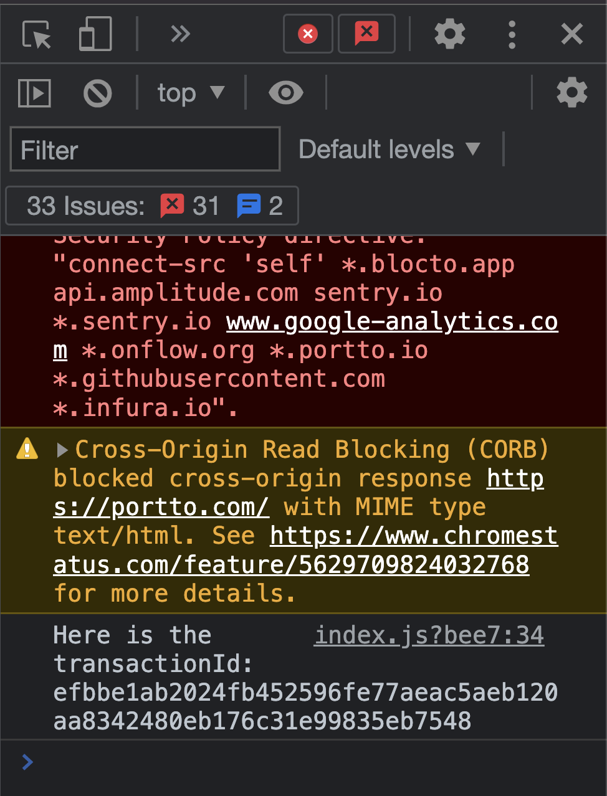
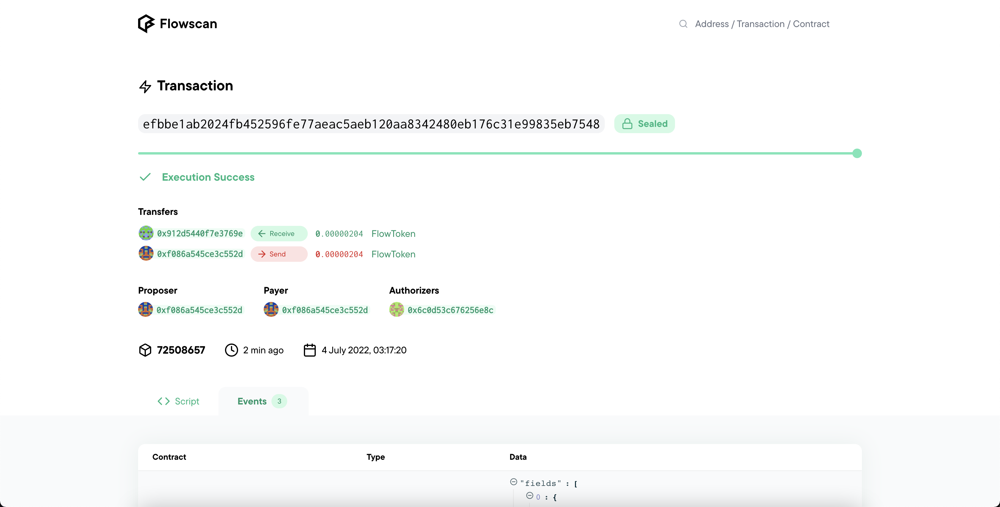

# Chapter 4 Day 4 - Sending a Transaction

Hi! Today, we will learn how to send a transaction using FCL so we can change our greeting in our DApp.

## Quick Overview of Transactions

If you remember back from Chapter 1, a transaction will allow us to *change* information inside our smart contracts. In addition, transactions cost **gas** and require someone to **sign** the transaction and send it to the blockchain.

We will utilize a transaction to change our `greeting` variable inside our smart contract, which we deployed in Chapter 3 Day 3.

## Overview of What We Have So Far

Before we add the final pieces of functionality to our DApp, let's take a quick breather to see what we currently have:



This is our application. It:
1. DONE: Lets us log in with our wallet
2. DONE: Automatically gets the greeting from the contract every time the page refreshes and displays it at the bottom
3. NOT DONE: Allows us to click a "Run Transaction" button that should run a transaction, using the input we type into the box as the `newGreeting`

We must complete step 3 in order to be fully done with the functionality of our DApp.

The good news is we already have the `runTransaction` function, we just need to put stuff inside it!

Here is *something similar* to what your `./pages/index.js` file should be right now, after completing the quests from the previous few days:

```javascript
import Head from 'next/head'
import styles from '../styles/Home.module.css'
import Nav from '../components/Nav.jsx';
import { useState, useEffect } from 'react';
import * as fcl from "@onflow/fcl";

export default function Home() {
  const [greeting, setGreeting] = useState('');
  const [newGreeting, setNewGreeting] = useState('');

  function runTransaction() {
    console.log("Running transaction!");
    console.log("Changing the greeting to: " + newGreeting);
  }

  async function executeScript() {
    const response = await fcl.query({
      cadence: `
      import HelloWorld from 0x90250c4359cebac7 // THIS WAS MY ADDRESS, USE YOURS
  
      pub fun main(): String {
          return HelloWorld.greeting
      }
      `,
      args: (arg, t) => []
    })

    setGreeting(response);
  }

  useEffect(() => {
    executeScript()
  }, [])

  return (
    <div>
      <Head>
        <title>Emerald DApp</title>
        <meta name="description" content="Created by Emerald Academy" />
        <link rel="icon" href="https://i.imgur.com/hvNtbgD.png" />
      </Head>

      <Nav />

      <main className={styles.main}>
        <h1 className={styles.title}>
          Welcome to my <a href="https://academy.ecdao.org" target="_blank">Emerald DApp!</a>
        </h1>
        <p>This is a DApp created by Jacob Tucker.</p>

        <div className={styles.flex}>
          <button onClick={runTransaction}>Run Transaction</button>
          <input onChange={(e) => setNewGreeting(e.target.value)} placeholder="Hello, Idiots!" />
        </div>
        <p>{greeting}</p>
      </main>
    </div>
  )
}
```

## Sending Transactions Using FCL

> Lets implement the `runTransaction` function by sending a transaction to change our greeting using FCL.

I will show you the default code to send a transaction, and then explain how it works:

```javascript
async function runTransaction() {
  const transactionId = await fcl.mutate({
    cadence: ``, // CADENCE CODE GOES IN THESE ``
    args: (arg, t) => [], // ARGUMENTS GO IN HERE
    proposer: , // PROPOSER GOES HERE
    payer: , // PAYER GOES HERE
    authorizations: [], // AUTHORIZATIONS GO HERE
    limit: // GAS LIMIT GOES HERE
  })

  console.log("Here is the transactionId: " + transactionId);
}
```

You'll see right off the bat that there is a lot more going on. After all, transactions are definitely more complicated.

First of all, instead of `await fcl.query()`, we use `await fcl.mutate()`. `mutate` signals that this is a transaction, whereas `query` is for scripts.

You already understand the `cadence` and `args` part. But what are the rest?
1. `proposer` - this is the *proposer* of a transaction (the person sending it to the blockchain).
2. `payer` - this is the *payer* of the transaction. Like we mentioned, transactions cost gas. Although transactions on Flow cost basically nothing (in fact they're free since wallets usually cover the cost), you still need to provide someone to pay.
3. `authorizations` - this is a list of *authorizors* of the transaction. Essentially, these are people that are saying "I am signing this transaction" and thus grant the transaction access to their account (for example, sending an NFT, paying someone, etc). If you go through our [Begginer Cadence Course](https://github.com/emerald-dao/beginner-cadence-course), you will learn much more about what this means. 
4. `limit` - the gas limit of the transaction. Usually, I just put 999 for all my transactions.

> Quick side note: transactions on Flow are very unique in that they have 3 roles: a payer, proposer, and authorizor. If you want to learn more about it, go here: https://docs.onflow.org/concepts/transaction-signing/#signer-roles

The cool thing is that all of this ends up being pretty easy in the end. In our case, we want to send a transaction that changes our greeting, or in other words, calls the `changeGreeting` function in our contract. We already wrote this transaction in Chapter 3 Day 2!

> Let's implement our function fully now...

```javascript
async function runTransaction() {
  const transactionId = await fcl.mutate({
    cadence: `
    import HelloWorld from 0x90250c4359cebac7 // THIS WAS MY ADDRESS, USE YOURS

    transaction(myNewGreeting: String) {

      prepare(signer: AuthAccount) {}

      execute {
        HelloWorld.changeGreeting(newGreeting: myNewGreeting)
      }
    }
    `,
    args: (arg, t) => [
      arg(newGreeting, t.String)
    ],
    proposer: fcl.authz,
    payer: fcl.authz,
    authorizations: [fcl.authz],
    limit: 999
  })

  console.log("Here is the transactionId: " + transactionId);
}
```

Okay, so what the heck just happened?
1. We filled in our Cadence script. Make sure to change the import to the contract that *you* deployed, not mine!
2. We added an argument because our transaction takes in 1 argument: `myNewGreeting: String`. We learned how to pass in arguments yesterday. The value we pass in is our `newGreeting` variable that we store using `useState`. We already made sure this was the value we type into the box in Chapter 2 Day 4.
3. We use something called `fcl.authz` for the `proposer`, `payer`, and `authorizations` array. What does `fcl.authz` mean? `fcl.authz` means "the person who is currently logged in." So when we run the transaction, whoever is logged in will fulfill all of those 3 roles.
4. We set the gas limit to 999 because whatever. If the transaction failed because of gas limits (it won't because this transaction is so cheap), we could just increase that number.

> Try clicking the "Run Transaction" button now after typing something into the input field. You should be able to run a transaction!



If you wait for a couple minutes and refresh the page, you will hopefully see your updated greeting displaying on the page ;)

Let's learn a little more about what's actually happening and how we can make this smoother...

## What is the `transactionId`?

You may be wondering what the `transactionId` is that is being returned from your function. Well, that's a unique hash you can use to search for your transaction.

After you click "Approve" on the Blocto transaction below...


...you should be able to open up your developer console and see a bunch of letters and numbers appearing. This is because we `console.log` the `transactionId` in our `runTransaction` function.



A transactionId can help you find information about your transaction. More specifically, you can do this on Flowscan!

> Copy + paste that transactionId, go to https://testnet.flowscan.org/, and paste it into the search bar. You should be able to discover your transaction!



## Updating the Displayed Greeting After Transaction

Now that we are changing the greeting, we want to make sure our frontend reflects this change. The problem is, right now, the greeting on our frontend only updates if the page refreshes. So lets add a simple call to `executeScript` after our transaction is done!

> Inside of `runTransaction`, after the `console.log`, add these lines:

```javascript
await fcl.tx(transactionId).onceSealed();
executeScript();
```

What this will do is take the `transactionId` we got from our transaction, wait for it to be completely done (that is what `onceSealed()` means), and then call our `executeScript` function which will read the newly updated greeting from our contract and change it on our webpage.

## Conclusion

CONGRADULATIONS! You have officially made a DApp that sends transactions and scripts! WOW, I am so proud and hype for you.

This also concludes Chapter 4. In Chapter 5, we will finalize our DApp.

## Quests

There are two lovely quests for today.

1. I deployed a contract called `SimpleTest` to an account with an address of `0x6c0d53c676256e8c`. I want you to make a button that, when clicked, sends a transaction to change the `number` variable from that contract. If you're curious, you can see the contract here: https://flow-view-source.com/testnet/account/0x6c0d53c676256e8c/contract/SimpleTest

2. Immediately after you send the transaction, wait for the transaction to be "Sealed" just like we did today. Then, call a script to read the `number` from the contract. Console log the result.

Submit all the code you used to send the transaction, and the result of the script.
