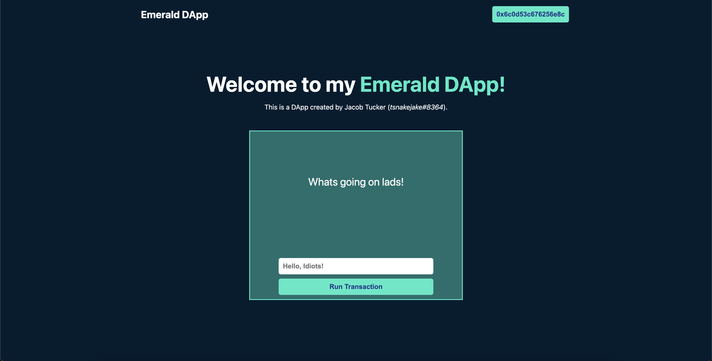

# Chapter 5 Day 1 - Finishing our DApp

In today's lesson, we're going to finalize our DApp by finishing up the styling and adding a cool effect to our transaction.

## Styling

Because this course is not intended to be a styling course, I will not spend a ton of time reviewing what changes we are going to make today.

Also, if you have already added styling to your DApp, do not feel like you have to follow these instructions. This is simply to make peoples' unstyled DApps look a lot nicer ;)

### ./pages/index.js

First of all, we're going to restructure our `./pages/index.js` file before adding some styling. 

Replace the `<main>` tag and everything inside of it with this code:

```html
<div className={styles.welcome}>
  <h1 className={styles.title}>
    Welcome to my <a href="https://academy.ecdao.org" target="_blank">Emerald DApp!</a>
  </h1>
  <p>This is a DApp created by Jacob Tucker (<i>tsnakejake#8364</i>).</p>
</div>

<main className={styles.main}>
  <p>{greeting}</p>
  <div className={styles.flex}>
    <input onChange={(e) => setNewGreeting(e.target.value)} placeholder="Hello, Idiots!" />
    <button onClick={runTransaction}>Run Transaction</button>
  </div>
</main>
```

Boom! We're done with that part. Now onto the styling.

### ./styles/globals.css

> In `./styles/globals.css`, under the `html, body` selector, add these lines of code:

```css
background-color: #011d30;
color: white;
```

Right away, you'll notice this changes the background color of your DApp and makes the text white.

> Then, at the bottom of the file, add this:

```css
button {
  padding: 10px;
  font-size: 16px;
  font-weight: bold;
  border-radius: 5px;
  outline: 0;
  border: 0px;
  margin: 5px;
  background-color: #35e9c6;
  color: #1e3a8a;
}
```

### ./styles/Home.module.css

Replace your `./styles/Home.module.css` file with this code:

```css
.welcome {
  text-align: center;
}

.welcome h1 {
  margin-bottom: 5px;
}

.title {
  position: relative;
  margin-top: 100px;
  font-size: 50px;
}

.title a {
  color: #35e8c5;
  text-decoration: none;
}

.main {
  position: relative;
  top: 30px;
  width: 30vw;
  min-width: 300px;
  height: 30vh;
  min-height: 400px;
  background-color: #176f6c;
  border: 2px solid #35e9c6;
  left: 50%;
  transform: translateX(-50%);
  text-align: center;
}

.main .flex {
  position: absolute;
  bottom: 5px;
  display: flex;
  flex-direction: column;
  width: 75%;
  left: 50%;
  transform: translateX(-50%);
}

.main p {
  position: relative;
  font-size: 25px;
  top: 20%;
}

.flex input {
  padding: 10px;
  font-size: 16px;
  font-weight: bold;
  border-radius: 5px;
  outline: 0;
  border: 0px;
  margin: 5px;
}
```

Your DApp should now look like this:



## Transaction Loading State

Your DApp is now looking super cool, and we're almost done. 

The only main issue now is that, when we run our transaction, we don't inform the user what is happening in the transaction, and it's hard to tell what stage of the transaction it's on. We're going to change that today!

In our `runTransaction` function, at the bottom, we have the following code:

```javascript
console.log("Here is the transactionId: " + transactionId);
await fcl.tx(transactionId).onceSealed();
executeScript();
```

We're going to spice this up a bit. 

### Quick Modifications

> But first, make a new variable called `txStatus` using `useState` and set the default value as "Run Transaction". 

I'm not going to show you how to do this because we have covered it previously.

Then, go down to the `<button>` tag that allows you to call `runTransaction` when you click it. 

> Instead of having "Run Transaction" as the text, make it be the `txStatus` variable instead. 

This way, the button's text will come from the `txStatus` variable.

### Tracking Loading State

Now, go back to your `runTransaction` function. After we `console.log` the `transactionId`, we're going to add code that will change the value of `txStatus` every time the status of the transaction changes.

> To do this, add this piece of code after the `console.log`:

```javascript
fcl.tx(transactionId).subscribe(res => {
  console.log(res);
}
```

What this will do is utilize a `subscribe` function that gives us the new status of the transaction every time it changes inside the `res` object. 

Go back to your webpage and run a transaction with the developer console open. Look at all the things being printed! They are being printed when the status of the transaction changes.

> Now, to actually update the value of `txStatus` properly, let's add some stuff:

```javascript
fcl.tx(transactionId).subscribe(res => {
  console.log(res);
  if (res.status === 0 || res.status === 1) {
    setTxStatus('Pending...');
  } else if (res.status === 2) {
    setTxStatus('Finalized...')
  } else if (res.status === 3) {
    setTxStatus('Executed...');
  } else if (res.status === 4) {
    setTxStatus('Sealed!');
  }
})
```

Notice that we are changing the value of `txStatus` using `setTxStatus`, and doing it based off of what the `res.status` is. 

> If you want more information about what these status codes mean, check out this page: https://docs.onflow.org/fcl/reference/api/#transaction-statuses

If you go back to your webpage and run another transaction, you will notice that the button text remains as "Sealed!" even after we are done. To change this, we can add one more line of code to our `subscribe` function:

```javascript
fcl.tx(transactionId).subscribe(res => {
  console.log(res);
  if (res.status === 0 || res.status === 1) {
    setTxStatus('Pending...');
  } else if (res.status === 2) {
    setTxStatus('Finalized...')
  } else if (res.status === 3) {
    setTxStatus('Executed...');
  } else if (res.status === 4) {
    setTxStatus('Sealed!');
    setTimeout(() => setTxStatus('Run Transaction'), 2000); // We added this line
  }
})
```

Notice that we added a `setTimeout` function inside our `if` statement that runs when the `res.status` is 4. A status of 4 means that the transaction is sealed, or completed. And what a `setTimeout` will do is run after a period of time, or in this case, after 2000 milliseconds (the number we provided as the second argument). So, after 2 seconds, it will change the button text back to "Run Transaction".

## Conclusion

We have officially completed our Emerald DApp. The only remaining step is to deploy our DApp so everyone can see it.

## Quests

1. List all the possible transaction status codes and what each of them mean.

2a. What does setTimeout do? 
2b. How would we change our code if we wanted the `txStatus` variable to reset back to its original state after 5 seconds?

3. What does the `fcl.tx(transactionId).subscribe(res => {...})` function do?

4. Make at least 3 changes to the styling of the application. It can be anything (part of this quest is being creative!). List the 3 changes and point them out in a screenshot.