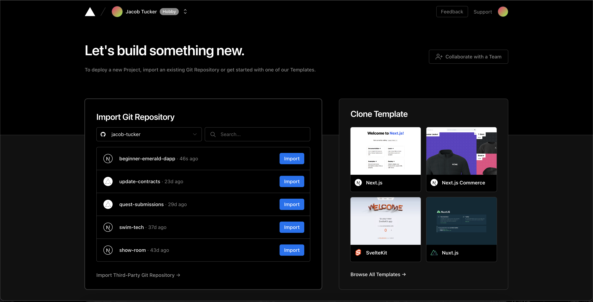
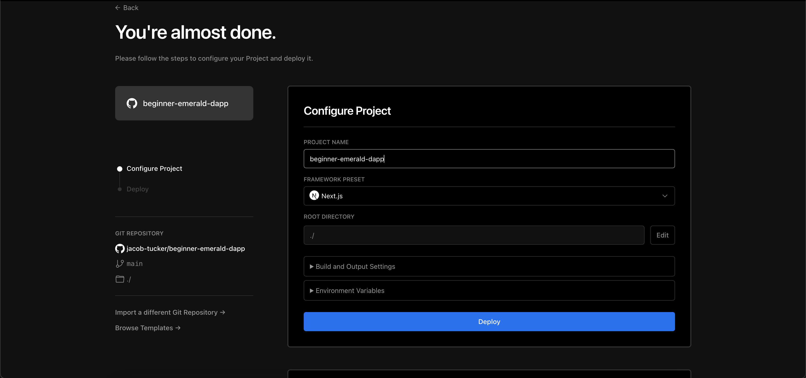
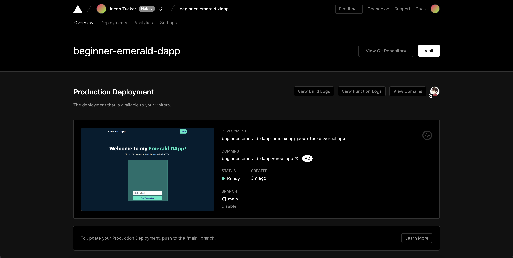

# Chapter 5 Day 2 - Deploying our DApp

In our last day (we're almost there!), we're going to be deploying our DApp to Vercel so everyone can see our DApp and interact with it.

## Vercel

What is Vercel? Well, it's basically magic. It allows you to select a GitHub repository and automatically deploy it for free so that it lives at a real URL, and then people can interact with it.

> *Important #1*: Delete the `.eslintrc.json` file in your project.

> *Important #2*: Before you go on, make sure you have pushed your latest code to your GitHub repository. To remember how to do this, go back to the bottom of Chapter 2 Day 1.

> Go to https://vercel.com/ and create an account

Then, go to your profile screen that looks like this:

> Find the repository that says "beginner-emerald-dapp" and press "Import".

> Then press "Deploy".

Wait a few minutes and make sure there are no errors. If there are, reach out in the Emerald Academy chat in the <a href="https://discord.gg/emeraldcity" target="_blank">Emerald City Discord</a>.

Then, you should be able to go to your deployed project on Vercel and find the URL where your project is deployed. 

Here is mine: https://beginner-emerald-dapp.vercel.app/

## Conclusion

YOU ARE DONE! AHHHHHHHH. YOU FINISHED THE BEGINNER DAPP COURSE! I am so proud of you.

If you want to check out other courses, please see our main webpage: https://academy.ecdao.org/

## Quests

1. Upload the URL to your application!